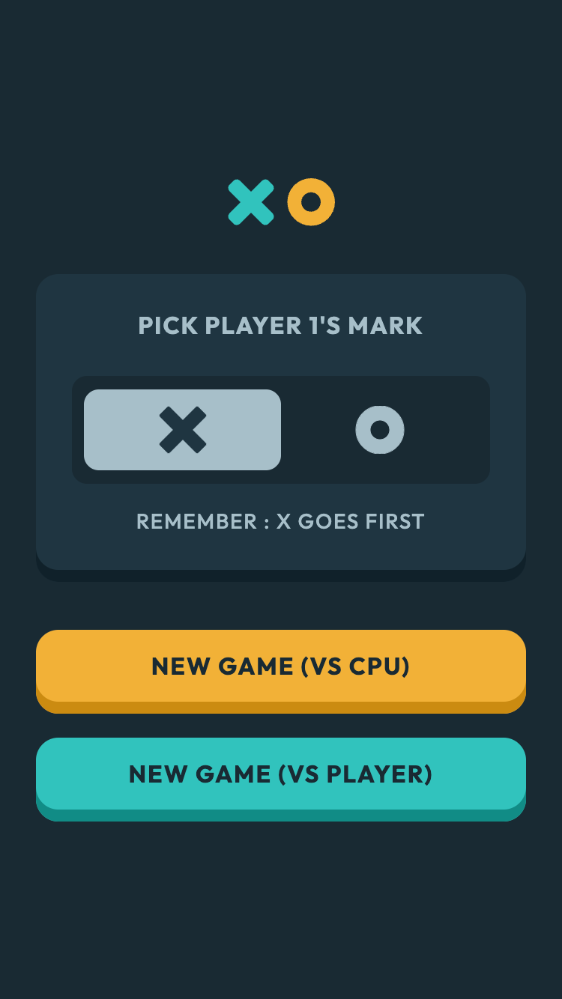
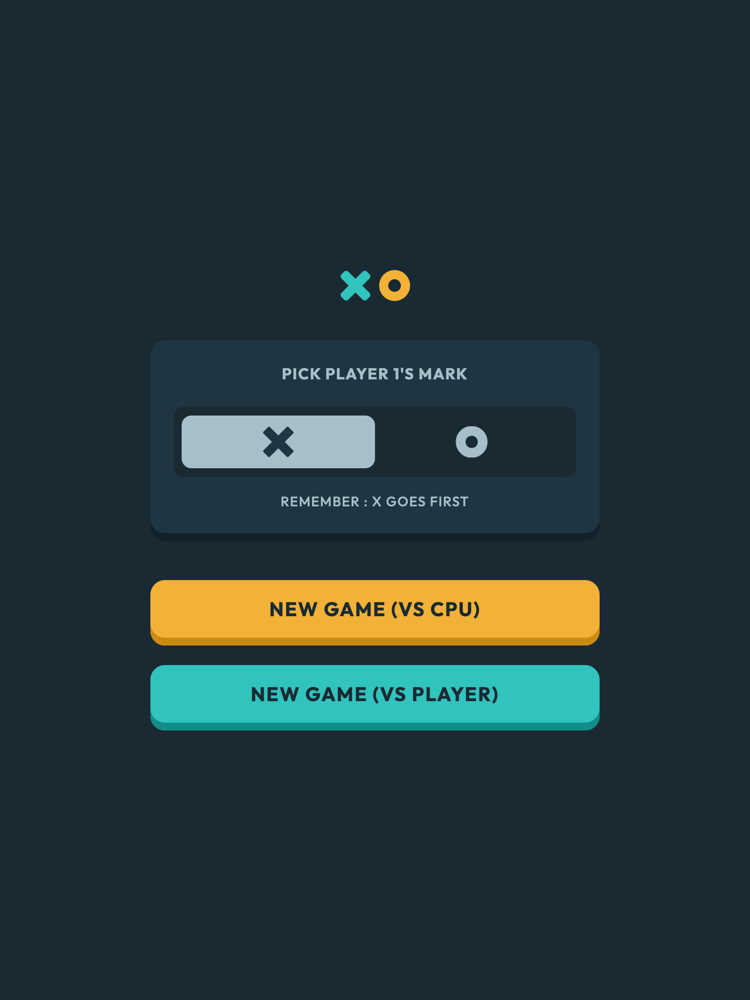
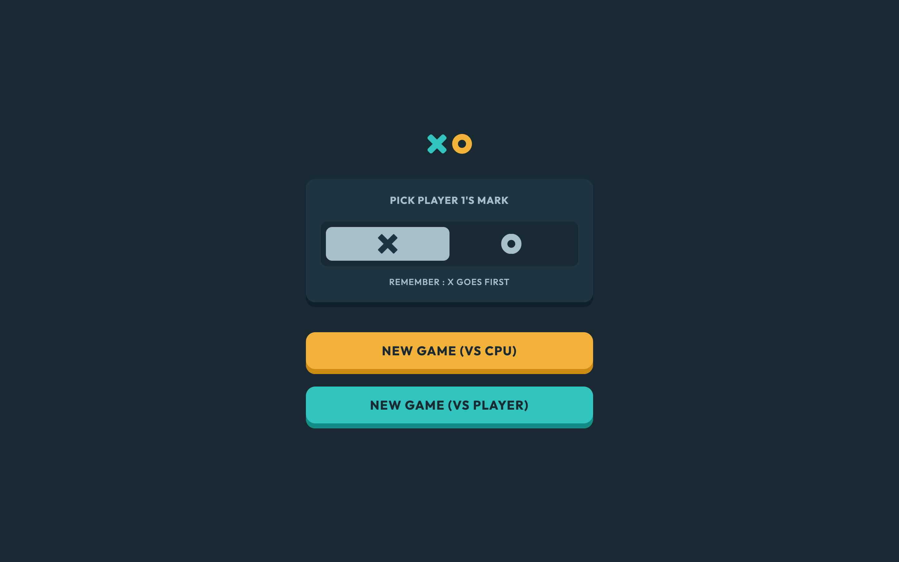
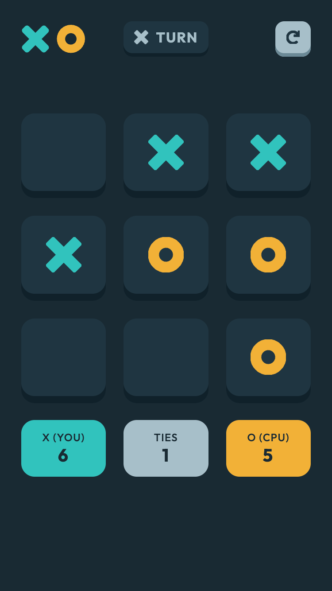
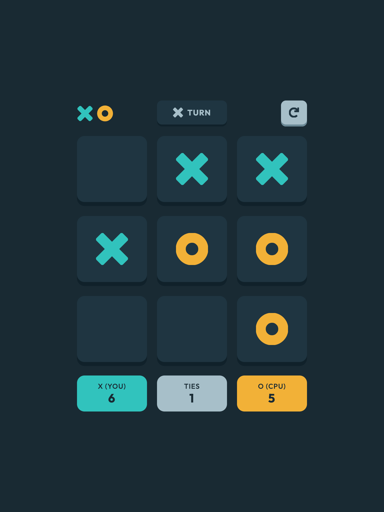
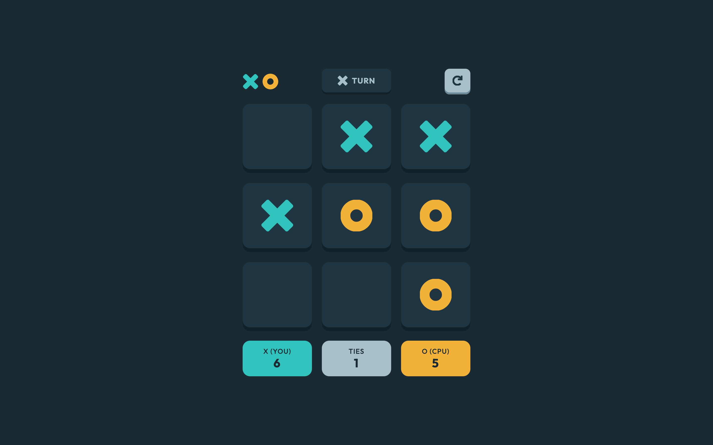
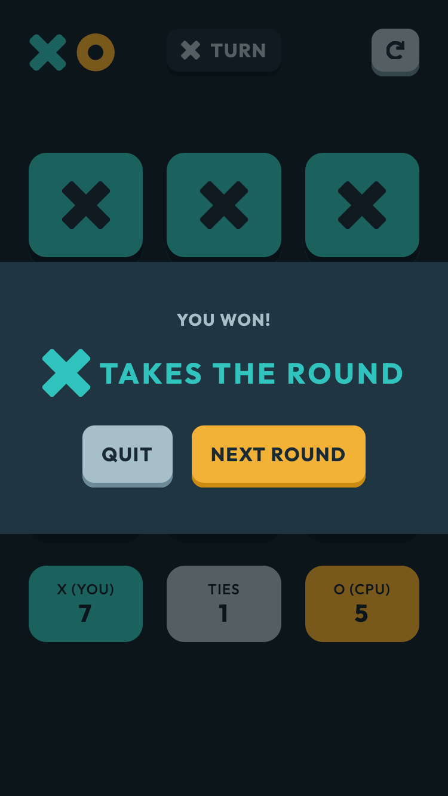
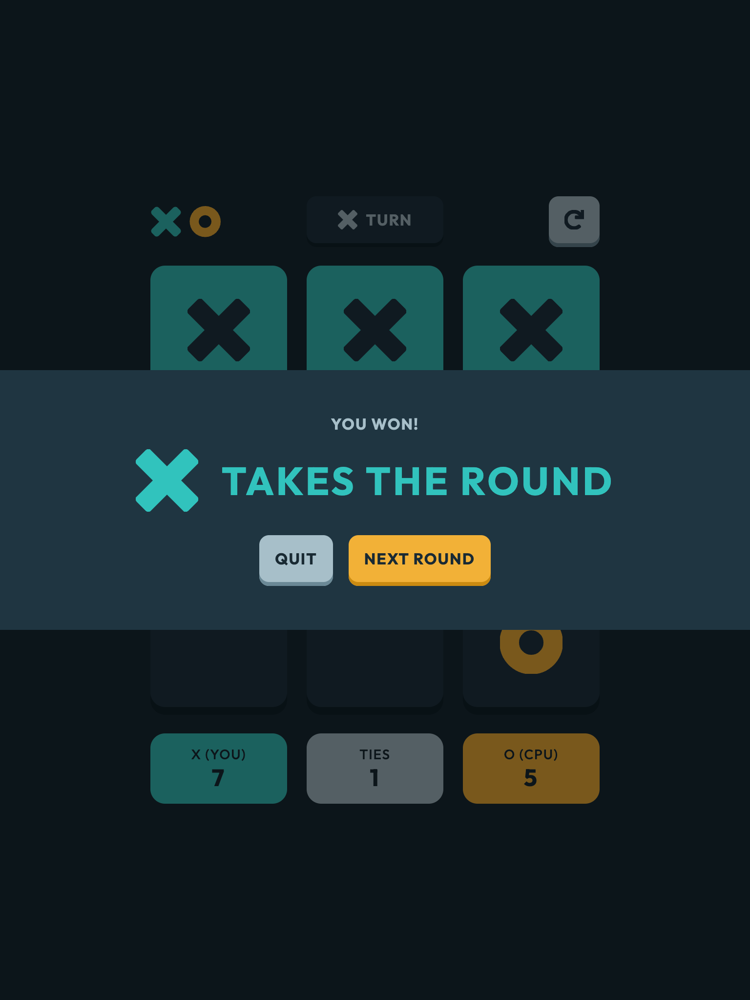
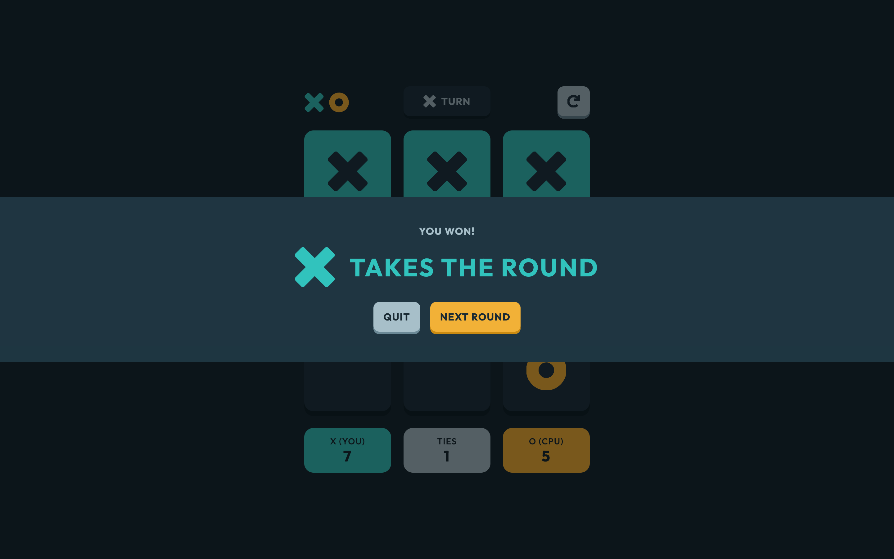

# Frontend Mentor - Tic Tac Toe solution

This is a solution to the [Tic Tac Toe challenge on Frontend Mentor](https://www.frontendmentor.io/challenges/tic-tac-toe-game-Re7ZF_E2v). Frontend Mentor challenges help you improve your coding skills by building realistic projects.

## Table of contents

- [Overview](#overview)
  - [The challenge](#the-challenge)
  - [Screenshots](#screenshots)
  - [Links](#links)
- [My process](#my-process)
  - [Built with](#built-with)
  - [What I learned](#what-i-learned)
  - [Continued development](#continued-development)
  - [Useful resources](#useful-resources)
- [Author](#author)

## Overview

### The challenge

Users should be able to:

- View the optimal layout for the game depending on their device's screen size
- See hover states for all interactive elements on the page
- Play the game either solo vs the computer or multiplayer against another person
- **Bonus 1**: Save the game state in the browser so that it’s preserved if the player refreshes their browser
- **Bonus 2**: Instead of having the computer randomly make their moves, try making it clever so it’s proactive in blocking your moves and trying to win

### Screenshots

|               Mobile designed at 375px:                |               Tablet designed at 768px:                | Desktop designed at 1440px:                             |
| :----------------------------------------------------: | :----------------------------------------------------: | ------------------------------------------------------- |
|  |  |  |
|                  Mobile (Game Solo):                   |                  Tablet (Game Solo):                   | Desktop (Game Solo):                                    |
|      |      |      |
|                   Mobile (You Won):                    |                   Tablet (You Won):                    | Desktop (You Won):                                      |
|        |        |        |

### Links

- Solution URL: [https://github.com/elisilk/tic-tac-toe](https://github.com/elisilk/tic-tac-toe)
- Live Site URL: [https://elisilk.github.io/tic-tac-toe/](https://elisilk.github.io/tic-tac-toe/)

## My process

### Built with

- Semantic HTML5 markup
- CSS custom properties
- Flexbox
- CSS Grid
- Mobile-first workflow
- Fluid typography
- Accessibility

### What I learned

Hmm 🤔 ...

- [SVG: Scalable Vector Graphics](https://developer.mozilla.org/en-US/docs/Web/SVG) - Using SVGs over and over again in different locations, sizes, colors, etc. So knowing how to best make use of them was critical.
  - [Everything You Need To Know About SVG](https://css-tricks.com/lodge/svg/)
    - [15 SVG Icon System – Where the defs go](https://css-tricks.com/lodge/svg/15-svg-icon-system-defs-go/)
  - [Accessible SVGs](https://css-tricks.com/accessible-svgs/)
  - [Change Color of SVG on Hover](https://css-tricks.com/change-color-of-svg-on-hover/)
  - [CSS Tricks articles tagged SVG](https://css-tricks.com/tag/svg/)
- [`<dialog>`](https://developer.mozilla.org/en-US/docs/Web/HTML/Element/dialog) and [`::backdrop`](https://developer.mozilla.org/en-US/docs/Web/CSS/::backdrop) - I used a `dialog` HTML element for the results and restart menus.
- Toggle and radio buttons
  - [Toggle Buttons from Inclusive Components](https://inclusive-components.design/toggle-button/)
  - [Replacing Radio Buttons Without Replacing Radio Buttons](https://www.sitepoint.com/replacing-radio-buttons-without-replacing-radio-buttons/)
  - [Building accessible toggle buttons (with examples for Svelte, Vue, and React)](https://joshcollinsworth.com/blog/accessible-toggle-buttons)
  - [Inclusively Hiding & Styling Checkboxes and Radio Buttons](https://www.sarasoueidan.com/blog/inclusively-hiding-and-styling-checkboxes-and-radio-buttons/)
- [Using CSS custom properties like this is a waste](https://youtu.be/_2LwjfYc1x8?si=jTnmMTEebpa4EMsm) - I was super inspired by this video by [Kevin Powell](https://www.youtube.com/@KevinPowell), which built off [this blog post by Lea Verou](https://lea.verou.me/blog/2021/10/custom-properties-with-defaults/). I really ran with this one, trying to create general but very customizable CSS components, including an `.icon` and a `.box`, each with a bunch of modifier classes that build on and extend the base class. It was a lot of fun to create them, and I hope I did it well.
- [Using data attributes](https://developer.mozilla.org/en-US/docs/Learn/HTML/Howto/Use_data_attributes) - I decided to give data attributes a try. I utilized them as a way to communicate between CSS and JavaScript for both the (1) whose turn it is `div`, plus (2) the results `dialog`. This way, I can show/hide the text and icons that are/aren't relevant for a particular situation, rather than having to continually insert/delete them using JavaScript as needed. I can imagine there are potential accessibility/screen reader issues with this approach, but I felt like it was fun to try. And I did utilize a more JavaScript insert/delete approach for the placing of marks on the gameboard, so I have a little of both in this solution.
  - [Cube CSS Exception](https://cube.fyi/exception.html#why-data-attributes) - I didn't exactly use data attributes in this way, but it was similar and sort of inspired by this.
- [Using CSS nesting](https://developer.mozilla.org/en-US/docs/Web/CSS/CSS_nesting/Using_CSS_nesting) - I started using nesting a lot more this challenge than I have in the past. It's super cool to keep the CSS more organized.
- [Element: mouseenter event](https://developer.mozilla.org/en-US/docs/Web/API/Element/mouseenter_event) and [Element: mouseleave event](https://developer.mozilla.org/en-US/docs/Web/API/Element/mouseleave_event)
- [Get elements with one class but not another without iterating](https://stackoverflow.com/questions/19492716/get-elements-with-one-class-but-not-another-without-iterating) - I used the [`:not()`](https://developer.mozilla.org/en-US/docs/Web/CSS/:not) CSS selector to select icons that were not outline icons (e.g., `gameboardSpace.querySelectorAll(".icon:not(.icon--outline)")`).
- [Create »svg« and »use« element with JavaScript](https://florianbrinkmann.com/en/svg-use-element-javascript-4513/) - Like the author in this post writes, "Creating SVG elements dynamically via JavaScript is not as easy as I thought". I loved the clarity, simplicity, and focus of this post. It doest one thing super well and was exactly what I needed.
  - [Document: createElementNS() method](https://developer.mozilla.org/en-US/docs/Web/API/Document/createElementNS)
  - [Element: setAttributeNS() method](https://developer.mozilla.org/en-US/docs/Web/API/Element/setAttributeNS)
- [`Object`](https://developer.mozilla.org/en-US/docs/Web/JavaScript/Reference/Global_Objects/Object) and [`Array`](https://developer.mozilla.org/en-US/docs/Web/JavaScript/Reference/Global_Objects/Array) - This challenge was great for working with objects in JavaScript. Within my `gameState` object, I made a `gameboard` object with an entry for each of the gameboard spaces. In a number of instances, I needed to be able to iterate over those spaces, or find a particular space, or filter out some of them. And each time, it was a cool exercise in making use of a number of powerful JavaScript methods directly on the Objects, or converting to an Array first. Those included:
  - [`Object.entries()`](https://developer.mozilla.org/en-US/docs/Web/JavaScript/Reference/Global_Objects/Object/entries)
  - [`Object.keys()`](https://developer.mozilla.org/en-US/docs/Web/JavaScript/Reference/Global_Objects/Object/keys)
  - [`Array.prototype.find()`](https://developer.mozilla.org/en-US/docs/Web/JavaScript/Reference/Global_Objects/Array/find)
  - [`Array.prototype.filter()`](https://developer.mozilla.org/en-US/docs/Web/JavaScript/Reference/Global_Objects/Array/filter)
  - [`Array.prototype.reduce()`](https://developer.mozilla.org/en-US/docs/Web/JavaScript/Reference/Global_Objects/Array/reduce)
  - [`Array.prototype.map()`](https://developer.mozilla.org/en-US/docs/Web/JavaScript/Reference/Global_Objects/Array/map)
- [Filter a JavaScript object's properties by keys or values](https://www.30secondsofcode.org/js/s/filter-object-keys/) - These utility functions are particularly cool in illustrating the power and generalizability of these functions.
  - [30 seconds of code](https://www.30secondsofcode.org/) - Actually this whole website is pretty much amazing. I decided to add it to my collection of Useful Resources, as I want to remember to go back to it often.
- [How to get a key in a JavaScript object by its value?](https://stackoverflow.com/questions/9907419/how-to-get-a-key-in-a-javascript-object-by-its-value)
- [Getting a random value from a JavaScript array](https://stackoverflow.com/questions/4550505/getting-a-random-value-from-a-javascript-array)
- [Spread syntax (...)](https://developer.mozilla.org/en-US/docs/Web/JavaScript/Reference/Operators/Spread_syntax) - I utilized this once, when adding a list of classes to a new HTML element, which enabled me to do it all in one simple line. But I am still learning under what conditions I can fully take advantage of this really cool operator.
- Styling `fieldset` and `legend` - I don't really understand why these HTML elements are so hard to style. I looked into some alternatives, but ultimately decided to just visually hide the `legend` and add a second `p` for the instructions. Probably not the best solution, but I just got frustrated with it. Oh well. Some resources I looked at, included:
  - [HTML SPEC 15.3.12 The fieldset and legend elements](https://html.spec.whatwg.org/multipage/rendering.html#the-fieldset-and-legend-elements)
  - [Default CSS values for a fieldset <legend>](https://stackoverflow.com/questions/3973456/default-css-values-for-a-fieldset-legend)
  - [LEGEND positioned inside FIELDSET](https://codepen.io/vkjgr/pen/OJOydq)
  - [How to get cross-browser form `fieldset` content height in % (with legend)](https://stackoverflow.com/questions/29967730/how-to-get-cross-browser-form-fieldset-content-height-in-with-legend) and the [associated CodePen](https://codepen.io/Volker_E/full/zqPjrK/)
  - [Fieldset, legend, border-radius and box-shadow](https://www.456bereastreet.com/archive/201302/fieldset_legend_border-radius_and_box-shadow/)
  - [Legends of Style](https://www.tyssendesign.com.au/articles/css/legends-of-style/) and the [associated examples](https://www.tyssendesign.com.au/shed/examples/styling-legends.html)

### Continued development

Specific areas that the solution should be improved (known issues):

- **Bonus #1**: Save the game state in the browser so that it’s preserved if the player refreshes their browser
- **Bonus #2**: Improve the CPU's game play algorithm; Instead of having the computer randomly make their moves, try making it clever so it’s proactive in blocking your moves and trying to win
- Figure out why the "O" icons seem to have the edges cut off a bit, and correct it
- Have a delay when the CPU is making a move
  - Make sure the handleGameboardSpaceMouseEnter and the handleGameboardSpaceClick are disabled (temporarily) so that a user cannot add in icons while it's the CPU's turn (or really until any animation is complete?)
- Animations
  - Changing the main menu radio button from X to O
  - When a mark is placed, especially when the CPU is placing it, so it's more obvious to the user
  - When user is placing a mark, it should animate from the outline to the filled in icon more seamlessly
  - Animate the changing of the whose turn icon
  - Animate the open and closing of the dialogs (and their backdrops)?
  - Animate the start of a new game? And the transition from the quit dialog to the main menu?
- Have an animation when the dialog is opened
- I have an outline on the radio buttons when the button is focused. But when the left radio buttin is in focus, the right side of the outline gets obscured by the right radio button. It would be great to figure out a way to make that outline come to the top. The design has the two buttons right next to each other with no gap, so that presents a challenge. And I like have a big chunky outline as I think it is consistent with the rest of the design. And I also like the outline extended a little beyond the box (instead of as an inset), since I think it is more visible on all the other boxes that way. But maybe the radio buttons should have a special modifier that puts their outline inset a bit since I'm not sure what other way to solve the issue.

More general ideas I want to consider:

Hmm 🤔 ...

### Useful resources

- [Accessibility Developer Guide](https://www.accessibility-developer-guide.com/)
- [MDN Web Docs for CSS](https://developer.mozilla.org/en-US/docs/Web/CSS) - Went here a lot to reference the different CSS properties and the shorthands, and all the great explanations about best practices.
- [MDN Guides](https://developer.mozilla.org/en-US/docs/Learn)
- [The Clamp Calculator](https://royalfig.github.io/fluid-typography-calculator/) - Used for all of fluid typography and fluid spacing calculations.
- [The Modern JavaScript Tutorial](https://javascript.info/)
- [Wes Bos - JavaScript Introduction](https://wesbos.com/javascript/01-the-basics/welcome) and other [courses](https://wesbos.com/courses)
- [30 seconds of code](https://www.30secondsofcode.org/)

## Author

- Website - [Eli Silk](https://github.com/elisilk)
- Frontend Mentor - [@elisilk](https://www.frontendmentor.io/profile/elisilk)
